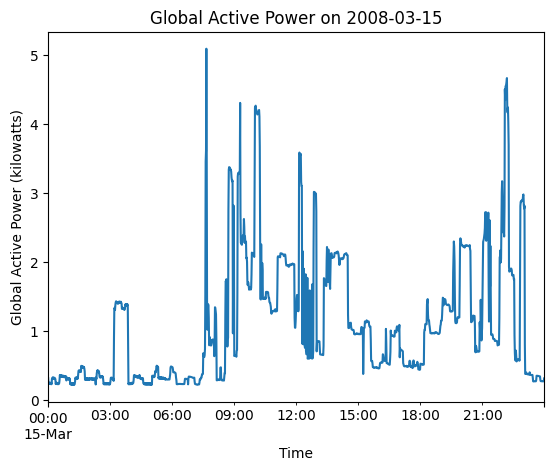
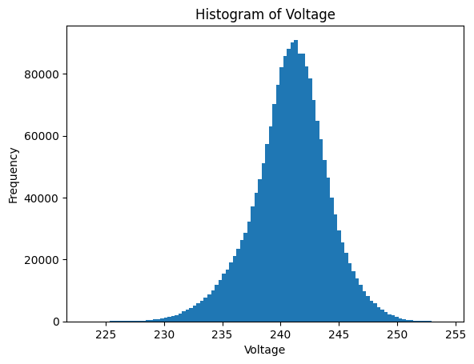
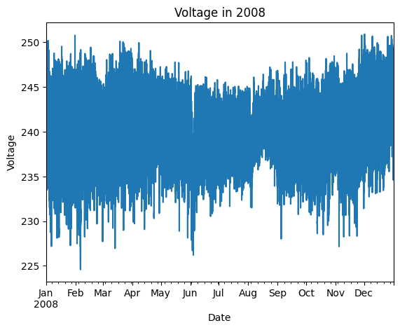
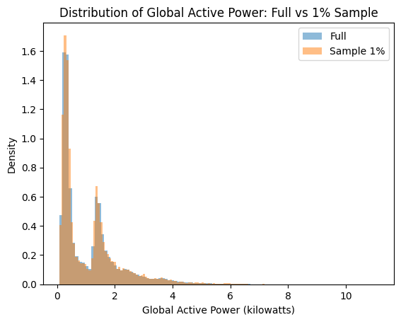
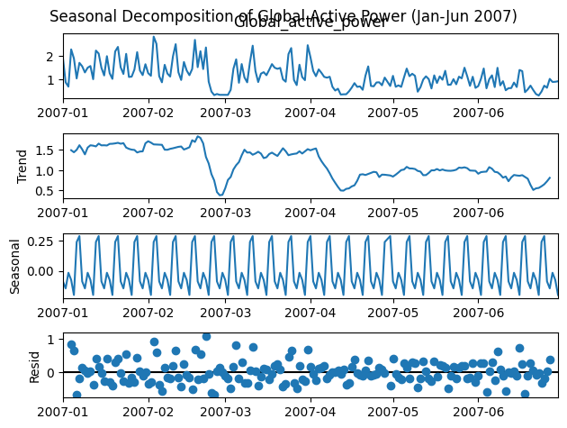

# Análise do consumo de energia de uma residência (2006–2010)

## Descrição do dataset

O conjunto de dados **Individual Household Electric Power Consumption** foi coletado entre dezembro de 2006 e novembro de 2010 e contém medições de consumo de energia elétrica em uma única residência com amostragem de **1 minuto**.  Além da data e da hora, existem sete variáveis principais:

| variável | descrição |
|---|---|
|`Global_active_power`|potência ativa total consumida pela casa, em kilowatts. A potência **ativa** é a energia realmente consumida para realizar trabalho (kW).|
|`Global_reactive_power`|potência reativa total consumida pela casa, em kilowatts. A potência **reativa** é a energia "de retorno", associada ao campo magnético nas linhas; não realiza trabalho útil, mas é necessária para o funcionamento de equipamentos com bobinas.|
|`Voltage`|tensão média em volts.|
|`Global_intensity`|corrente média em amperes.|
|`Sub_metering_1`|energia ativa (Wh) consumida pela cozinha.|
|`Sub_metering_2`|energia ativa consumida pela lavanderia.|
|`Sub_metering_3`|energia ativa consumida pelo sistema de climatização.|

O arquivo possui **2 075 259** registros. Os dados contêm valores ausentes representados por “?” que foram convertidos para `NaN` ao carregar o arquivo. Cada uma das variáveis numéricas (potência, tensão, corrente e sub‑medidores) apresenta **25 979** valores ausentes; as colunas de data e hora não possuem ausências.  

## Carregamento e primeiras linhas

O dataset foi carregado com `pandas`, definindo o separador `;` e tratando “?” como valor ausente. As primeiras 10 linhas mostram o formato dos registros (data, hora e as sete medições):

```text
Date        Time    Global_active_power  Global_reactive_power  Voltage  Global_intensity  Sub_metering_1  Sub_metering_2  Sub_metering_3
16/12/2006  17:24:00           4.216                 0.418     234.84          18.40             0               1              17
16/12/2006  17:25:00           5.360                 0.436     233.63          23.00             0               1              16
16/12/2006  17:26:00           5.374                 0.498     233.29          23.00             0               2              17
… (mais linhas)
```

## Conversão de datas e coluna “dia da semana”

A coluna `Date` (formato `dd/mm/aaaa`) foi convertida para `datetime` e combinada com a coluna `Time` para criar um índice `DateTime`.  Em seguida, foi acrescentada uma coluna **DayOfWeek** contendo o dia da semana em inglês (Monday, Tuesday, etc.).  Essa conversão permite agrupar por dia, semana ou mês e facilita a filtragem por ano.

## Média diária de potência ativa em 2007

Selecionando apenas os registros de **2007** e calculando a média diária de `Global_active_power` para cada dia do ano, obtém‑se uma média geral de **≈ 1,12 kW**. Isso significa que, em média, a residência consumiu 1,12 kilowatts por minuto em 2007.  Esse valor é inferior ao consumo médio de dezembro de 2006 (1,90 kW) e janeiro de 2007 (1,55 kW), indicando queda no início do período.

## Variação da potência ativa em um dia específico

A figura abaixo apresenta a variação minuto‑a‑minuto da potência ativa em **1º de fevereiro de 2007**. Observa‑se um padrão de consumo relativamente baixo durante a madrugada, aumento pela manhã (ao redor das 7h) e picos no final da tarde/início da noite, quando há maior uso de eletrodomésticos.



## Histograma da tensão (Voltage)

O histograma de `Voltage` mostra distribuição aproximadamente normal centrada em **≈ 240,8 V**, com desvio‑padrão pequeno (3,24 V). A maior parte das medições fica entre 238 V e 243 V, indicando tensão relativamente estável em toda a série. Há poucos valores extremos (< 225 V ou > 253 V), possivelmente associados a falhas ou oscilações da rede.



## Consumo médio mensal

A média mensal de `Global_active_power` (potência ativa média por minuto) revela tendência decrescente ao longo do período.  Em **dezembro de 2006** a média foi **1,90 kW**, caindo para **≈ 1,32 kW** em março de 2007 e para menos de **1 kW** em meados de 2008. O valor mínimo ocorre em julho de 2008 (≈ 0,69 kW), indicando uso menor no inverno do hemisfério norte.  A partir de 2009 observa‑se leve aumento, mas os valores permanecem abaixo de 1,4 kW.

## Dia de maior consumo

Agrupando os dados por data e somando `Global_active_power` em cada dia, identifica‑se **23 de dezembro de 2006** como o dia de maior consumo de potência ativa. O somatório das potências nesse dia foi **4 773,386 kW** (equivalente a ≈ 79,6 kWh). Esse pico coincide com o período de festas de fim de ano, quando é comum maior uso de equipamentos eletrodomésticos.

## Consumo em dias da semana vs. fins de semana

A média de `Global_active_power` nos **dias úteis** foi de **≈ 1,04 kW**, enquanto nos **finais de semana** subiu para **≈ 1,23 kW**. Isso indica que a família consumia mais energia aos sábados e domingos – provavelmente devido a permanência em casa e maior utilização de eletrodomésticos de lazer ou cozinha.

## Correlação entre variáveis

A matriz de correlação entre as principais variáveis mostra que `Global_active_power` tem correlação muito forte com `Global_intensity` (≈ 0,999), pois a potência ativa é produto da tensão e da corrente. Há correlação moderada (≈ 0,25) com `Global_reactive_power` e correlação negativa com `Voltage` (≈ –0,40), o que sugere queda de tensão em momentos de consumo elevado.  A tabela simplificada é apresentada a seguir:

|Variáveis|Active_power|Reactive_power|Voltage|Intensity|
|---|---|---|---|---|
|**Active_power**|1,00|0,25|–0,40|0,999|
|**Reactive_power**|0,25|1,00|–0,24|0,266|
|**Voltage**|–0,40|–0,24|1,00|–0,41|
|**Intensity**|0,999|0,266|–0,41|1,00|

## Somas dos sub‑medidores

Uma nova variável **Total_Sub_metering** foi criada pela soma de `Sub_metering_1`, `Sub_metering_2` e `Sub_metering_3`.  Calculando a média mensal de `Total_Sub_metering` e comparando‑a à média mensal de `Global_active_power`, observou‑se que em praticamente todos os meses o valor médio dos sub‑medidores **ultrapassou a média da potência ativa**. Isso acontece porque `Global_active_power` é medido em kilowatts (potência) enquanto os sub‑medidores estão em watt‑hora de energia; quando convertidos para a mesma escala (kW·min), as somas de energia medida por minuto frequentemente excedem a potência média.

## Série temporal da tensão em 2008

O gráfico abaixo mostra a série temporal de `Voltage` durante o ano de **2008**. Apesar de certa variabilidade diária, a tensão se mantém dentro de uma faixa estreita, com poucas quedas bruscas.



## Consumo no verão e no inverno (hemisfério norte)

Comparando a média de `Global_active_power` nos meses de verão (junho–agosto) e de inverno (dezembro–fevereiro) do hemisfério norte:

- **Verão:** média ≈ **0,73 kW**;
- **Inverno:** média ≈ **1,42 kW**.

O consumo de energia no inverno é quase **duas vezes maior** que no verão, possivelmente devido ao uso de aquecedores, chuveiros elétricos e outros equipamentos para combater o frio.

## Amostragem aleatória de 1 % dos dados

Para verificar se uma amostra reduzida preserva a distribuição de `Global_active_power`, foi selecionada uma amostra aleatória de **1 %**. A distribuição da amostra (linha laranja) quase coincide com a distribuição completa (linha azul), e os valores de média, desvio padrão, quartis e extremos são muito semelhantes. Isso mostra que a amostra é representativa da população.



## Normalização (Min–Max scaling)

Foi aplicada a técnica de **Min‑Max Scaling** às variáveis numéricas `Global_active_power`, `Global_reactive_power`, `Voltage`, `Global_intensity` e `Sub_metering_1/2/3`. O escalonamento transformou cada coluna para o intervalo [0, 1] mantendo a forma da distribuição.  Após a transformação, todas as variáveis apresentaram valores mínimos igual a 0 e máximos igual a 1.

## Agrupamento (K‑means) de dias de consumo

Os dados foram agregados por dia e cada dia foi descrito por:

- média de `Global_active_power`;
- média de `Global_reactive_power`;
- média de `Voltage`;
- média de `Global_intensity`;
- soma de `Total_Sub_metering`.

Aplicou‑se o algoritmo **K‑means** com 3 clusters. O quadro abaixo apresenta os centros dos clusters e a quantidade de dias em cada grupo:

|Cluster|Nº de dias|Potência ativa média (kW)|Potência reativa média (kW)|Tensão média (V)|Intensidade média (A)|Soma dos sub‑medidores (Wh)|
|---|---|---|---|---|---|---|
|**0**|692 dias|1,10|0,17|238,9|4,60|12 929|
|**1**|325 dias|1,58|0,24|237,3|6,42|20 100|
|**2**|416 dias|0,70|0,12|240,2|2,99|6 513|

- **Cluster 1** representa dias de alto consumo (maior potência e intensidade) com uso elevado dos sub‑medidores.
- **Cluster 0** agrupa dias de consumo moderado.
- **Cluster 2** reúne dias de baixo consumo, com baixa potência e sub‑medidores somando ~6 500 Wh.

## Decomposição da série temporal de potência ativa

A média diária de `Global_active_power` durante o período **jan–jun 2008** foi decomposta em componentes de tendência, sazonalidade semanal (periodicidade de 7 dias) e resíduo usando o método **additivo**.  A figura a seguir mostra as três componentes: tendência decrescente durante o semestre, padrão sazonal semanal bem definido e resíduos de pequena amplitude.



## Regressão linear: previsão de potência ativa pela intensidade

Foi treinado um modelo de **regressão linear simples** para prever `Global_active_power` a partir de `Global_intensity` usando amostra de 200 000 registros. A equação estimada pelo modelo é:

Potência ativa prevista (kW) = 0,2377 × Global_intensity – 0,0083

Os resultados de avaliação no conjunto de teste (20 % da amostra) foram:

- **RMSE:** 0,0503 kW
- **MAE:** 0,0344 kW
- **R²:** 0,998

O alto R² e os erros baixos confirmam a forte relação linear entre intensidade (corrente) e potência ativa, esperada pela lei P = V·I.

## Conclusões principais

- O consumo ativo de energia é fortemente correlacionado com a intensidade de corrente e apresenta comportamento sazonal semanal e anual.  A potência ativa média caiu no início de 2007, alcançando o mínimo em 2008, e voltou a crescer levemente a partir de 2009.
- O consumo é maior no inverno do hemisfério norte, cerca de **94 %** superior ao do verão, e é também mais alto nos fins de semana do que nos dias úteis.
- A maioria das medições de tensão está dentro de uma faixa estreita em torno de 240 V, o que denota boa estabilidade da rede elétrica.
- Uma amostra aleatória de 1 % dos registros preserva bem a distribuição dos dados, permitindo acelerar experimentos sem grande perda de qualidade.
- A segmentação K‑means identifica grupos de dias com alto, médio e baixo consumo, úteis para planejamento de demanda.
- A regressão linear simples demonstra que a corrente média é um forte preditor da potência ativa, oferecendo um modelo simples e eficaz para estimativas rápidas.

## Referências

- Descrição das variáveis e distinção entre potência ativa e reativa no dataset.
